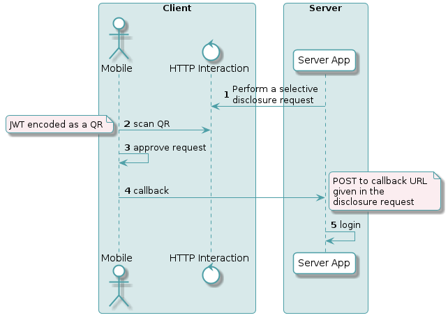

## Introduction

Creating a simple login solution with uport-credentials can be accomplished with a small Node.js application to request verified data about an ethereum identity.



In a minimal example, data is requested and a uPort client representing the ethereum identity approves the disclosure of the requested information.  This is called a *selective disclosure request* and is the primary means by which to validate the credentials of a user.  

After server-side business logic has been satisfied with the disclosed data, a user can be considered authenticated by virtue of the of verified credentials they disclosed.

The intention of this content is to provide a simple solution to bring familiarity to core concepts in uPort's ecosystem.  

The following examples utilize the selective disclosure flow and request/response patterns to provide an example of how to use these concepts for a login scenario:

- [Selective Disclosure flow](/flows/selectivedisclosure)
- [Selective Disclosure Request](/messages/sharereq)
- [Selective Disclosure Response](/messages/shareresp)

In addition to the above concepts and uport-credentials, also note the following requirements before starting this example:

- NodeJS
- Create a folder for the example and `cd ./example && npm init` 
- Install dependencies `npm install --save ngrok express did-jwt uport-transports uport-credentials`

This content is best if followed by interacting with a node console.

## Setup

The first order of business to creating any server side solution with uport-credentials is to obtain an application identity.  These identities are used to configure a uport-credentials object and can also be thought of as an ethereum key pair with a few extra capabilities made possible by adhering to [ERC-1056](https://github.com/ethereum/EIPs/issues/1056).

After installing `uport-credentials` as a dependency, create the *application identity* that will be used to sign requests:

```js
const { Credentials } = require('uport-credentials');
Credentials.createIdentity();
```
##### Output:

```json 
{ 
  did: 'did:ethr:0x31486054a6ad2c0b685cd89ce0ba018e210d504e',
  privateKey: 'ef6a01d0d98ba08bd23ee8b0c650076c65d629560940de9935d0f46f00679e01' 
}
```
Save the output from the identity creation for later.  Please note that the private key *should* be kept secure!  The private key shown in this guide is for *information purposes* only.

### Boilerplate

First, require and configure dependencies.  Their usage will be explained later, however you should change this boilerplate code swapping the proper `appName`, `did`, and `privateKey` that was obtained during [setup](#setup) to instantiate a new Credentials() object. 

```js
const express = require('express')
const bodyParser = require('body-parser')
const ngrok = require('ngrok')
const decodeJWT = require('did-jwt').decodeJWT
const { Credentials } = require('uport-credentials')
const transports = require('uport-transports').transport
const message = require('uport-transports').message.util

let endpoint = ''
const app = express();
app.use(bodyParser.json({ type: '*/*' }))

//setup Credentials object with newly created application identity.
const credentials = new Credentials({
  appName: 'Login Example',
  did: 'did:ethr:0x31486054a6ad2c0b685cd89ce0ba018e210d504e',
  privateKey: 'ef6a01d0d98ba08bd23ee8b0c650076c65d629560940de9935d0f46f00679e01'
})
```

## Disclosure Request Login Service

With the boilerplate out of the way we can define our endpoint that constructs a selective disclosure message (JWT).

At it's simplest a server-side login service that uses uPort for authentication involves:

- the creation of a disclosure request message as a JWT to be consumed by the mobile application
- a callback server to post selective disclosure responses back to.

Below is a simple ExpressJS endpoint that will listen for an incoming request and generate a valid JWT, the contents of which form a selective disclosure request for a mobile user's name, and permission to push notifications.  More details can be requested, but for the purpose of this guide we will keep it simple and only ask for a name and notifications.

Also note that the `callbackURL` attribute is intended to reference an endpoint that will accept the response of the request.  This endpoint will be setup in the next section, but also note that it needs to be a publicly accessible IP address or URL to receive the response.  

For now you can trust that the `endpoint` variable will be populated at the time this endpoint is requested.

#### Selective Disclosure Request

```js
app.get('/', (req, res) => {
  credentials.createDisclosureRequest({
    requested: ["name"],
    notifications: true,
    callbackUrl: endpoint + '/callback'
  }).then(requestToken => {
    console.log(decodeJWT(requestToken))  //log request token to console
    const uri = message.paramsToQueryString(message.messageToURI(requestToken), {callback_type: 'post'})
    const qr =  transports.ui.getImageDataURI(uri)
    res.send(`<div></div>`)
  })
})
```

This example is intentionally kept simple, but you can alternatively program the creation of the disclosure request to a more traditional "Sign In" button, executing the code when the button is clicked.  This code waits for a "login" request and generates a message encoded as a JWT formed into a URL.  A QR code will be generated from the JWT URL using a Uport-Transports utility function, and displayed when the endpoint is requested.  

Think of this endpoint as a login request service, though a disclosure request can be used to request many types of information and the JWT can be transmitted to the client in many different ways.  This is one example.

## Disclosure Response Authentication Service

On each request the response will be sent to a callback URL that is defined when the request is made.  A second endpoint is endpoint to capture that response is necessary.  In the previous example where a disclosure request is created, the `callbackURL` actually references this endpoint.

#### Selective Disclosure Response

```js
app.post('/callback', (req, res) => {
  const jwt = req.body.access_token
  console.log(jwt);
  credentials.authenticateDisclosureResponse(jwt).then(credentials => {
    console.log(credentials);
    // Validate the information and apply authorization logic
  }).catch( err => {
    console.log(err)
  })
})

// run the app server and tunneling service
const server = app.listen(8088, () => {
  ngrok.connect(8088).then(ngrokUrl => {
    endpoint = ngrokUrl
    console.log(`Login Service running, open at ${endpoint}`)
  })
})
```
What this callback endpoint is doing will feed the response token from the disclosure request to a function `authenticateDisclosureResponse` which will verify the signature of the response payload and the signatures of credentials included in the response.  It is at this point that proprietary authorization logic can be applied.

## Running the Service

Combining everything and running it will display a message in the terminal like `Login Service running, open at https://f70c25bd.ngrok.io`. 

All that is left to do is to try it out!

- Open a browser and navigate to this URL to generate a QR code.
- Scan the QR with the uPort mobile client
- Approve (or deny) the disclosure request
- Inspect the output in the console


